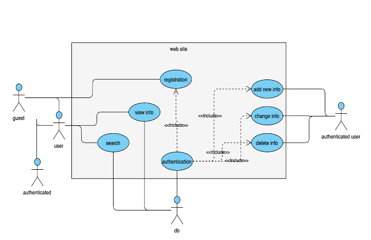

# PHP-CRUD-application-
This project is a part of my web programing course. It was created to demostrate gained up to now knowledge including HPH, MySQL and front-end developlemt(HTML,CSS). The website provides ground CRUD functionality by using PHP and MySQL database. The outline of a blog porvides user with ability to read the posted information, register and login to the website, create their own posts, delete and update them. Visit the website [here](https://s5216253.bucomputing.uk/project/index.php).

### Technologies

* PHP 7
* HTML 5
* MySQL

### UML

Simple Use-case UML diagram was created at the begining of the development for better understanding of recuirments.
Diagram: 

### Status 

The project has basic functionality that can be improved. The next step is to include search functionality and allow users to uppload varius data such as: immages, audio files, links etc. Use JavaScrip to increase the functionality and make it more user-friendly.

